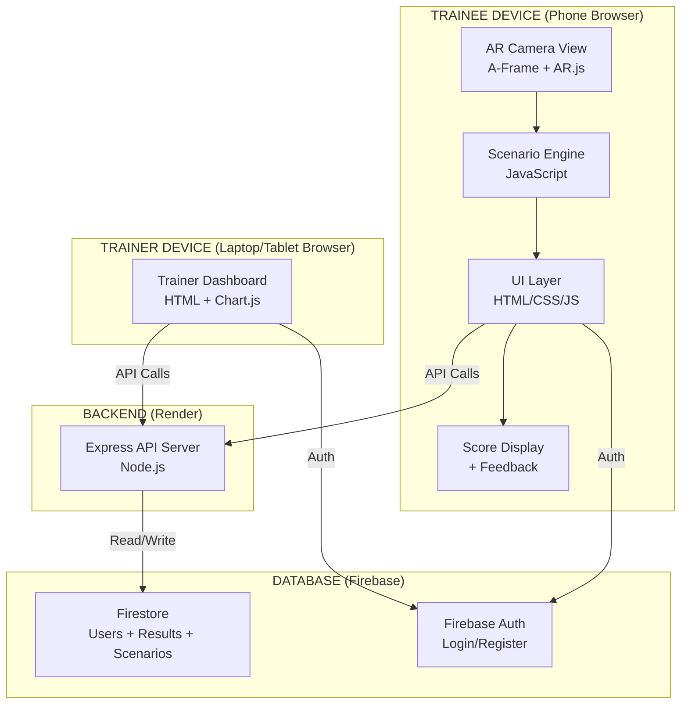
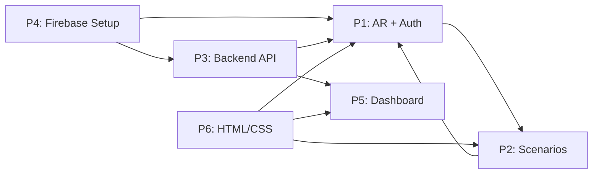

# SIH26041 — AR-Based Vocational Training Simulator for Industrial Safety
## Complete Execution Plan for 6-Member Team
### Deadline: 10 September 2026

---

# PART 1 — PROBLEM STATEMENT ANALYSIS

## 1. What is the actual problem?

Workers in Jharkhand's mining and manufacturing sectors face life-threatening industrial hazards daily. Traditional safety training (classroom lectures, printed manuals, occasional drills) fails to prepare them for real-world dangerous situations because they cannot safely practice responding to emergencies.

**CONFIRMED FACT:** Jharkhand is a major mining state in India. The Directorate General of Mines Safety (DGMS) is headquartered in Dhanbad, Jharkhand.

**CONFIRMED FACT:** Common mining hazards include roof falls, gas accumulation (methane), dust exposure (silicosis risk), equipment failures, fire, and electrical hazards.

## 2. The deeper problem behind the wording

The PS says "AR-Based Vocational Training Simulator." Breaking this down:

| Term | Meaning |
|------|---------|
| **AR-Based** | Augmented Reality — overlay digital information on the real world through a phone/tablet camera |
| **Vocational Training** | Practical skill training for specific jobs (not academic education) |
| **Simulator** | A system that mimics real situations so trainees can practice safely |
| **Industrial Safety** | Preventing workplace accidents, injuries, and deaths |
| **Jharkhand's Mining & Manufacturing** | Specifically for coal mines, iron ore mines, steel plants, and related industries in Jharkhand |

**The deeper problem:** You cannot safely teach a worker how to respond to a gas leak by creating an actual gas leak. You need a safe way to simulate dangerous situations and let workers practice their responses.

## 3. Primary user

**The Trainee** — A mine worker, factory worker, or new employee in Jharkhand's mining/manufacturing sector who needs safety training before or during their job.

**ASSUMPTION:** The trainee has basic smartphone literacy (can use a phone camera, tap buttons).

## 4. Secondary users

- **Safety Trainer / Instructor** — The person who conducts training sessions and monitors trainee progress
- **Safety Officer / Manager** — The person responsible for ensuring workers are trained and compliant

## 5. Stakeholders

- Government of Jharkhand (problem owner)
- DGMS (Directorate General of Mines Safety)
- Mining/manufacturing companies
- Workers and their families
- Training institutions

## 6. Current/traditional training approach

| Method | How it works |
|--------|-------------|
| Classroom lectures | Instructor teaches safety rules using slides/boards |
| Printed manuals | Workers read safety procedure booklets |
| Video training | Workers watch safety demonstration videos |
| Physical drills | Periodic fire drills or evacuation practices |
| On-the-job shadowing | New workers follow experienced workers |

## 7. Limitations of traditional training

| Limitation | Why it matters |
|-----------|---------------|
| **Passive learning** | Workers listen but don't practice decisions |
| **No safe practice** | Cannot simulate gas leaks, roof collapses safely |
| **Language barriers** | Written materials may not work for all literacy levels |
| **Infrequent** | Training happens once, then forgotten |
| **No feedback** | No way to measure if a worker truly learned |
| **No repeatability** | Cannot easily repeat scenarios |
| **Cost** | Physical drills are expensive to organize |
| **No data** | Trainers cannot track individual progress |

## 8. Why is AR relevant?

AR is NOT just a buzzword here. It genuinely adds value because:

- **Contextual learning:** Workers can see virtual hazards overlaid on their real environment (or a training room)
- **Safe simulation:** Dangerous scenarios appear virtually — no actual danger
- **Visual learning:** Workers SEE what a gas leak warning looks like, what correct PPE looks like
- **Interactive:** Workers make decisions by tapping/clicking, not just watching
- **Accessible:** Works on any smartphone with a camera — no expensive VR headsets needed
- **Repeatable:** Can practice the same scenario multiple times

## 9. What "vocational training" means here

Vocational = practical job skills. This is NOT academic theory. Training should teach workers:
- How to identify hazards
- What PPE to wear and when
- How to respond to emergencies
- What to do and what NOT to do in specific dangerous situations

## 10. What "simulator" actually means

A simulator is NOT just showing 3D models. A simulator must:
- Present a **situation**
- Allow the user to **make decisions/take actions**
- **React** based on the user's choice (correct → safe outcome, incorrect → dangerous consequence)
- Provide **feedback** on what was right/wrong
- Record a **score** to measure learning

**This is what separates us from "just an AR app" — we simulate decision-making under pressure.**

## 11. What makes it a simulator vs. merely a 3D/AR app?

| Just a 3D/AR App | A Simulator |
|-------------------|-------------|
| Shows 3D models | Presents scenarios with choices |
| Passive viewing | Active decision-making |
| No consequences | Correct/incorrect outcomes |
| No score | Performance tracking |
| No feedback | Explains why the response was right/wrong |
| Demo only | Training tool |

## 12. Expected outcomes

- Workers complete scenario-based safety training
- Workers demonstrate correct hazard identification
- Workers demonstrate correct emergency responses
- Trainers can view performance data
- Training can be repeated and tracked

## 13. Constraints

| Constraint | Impact |
|-----------|--------|
| 12-day development window | Must build MVP, not full product |
| 6 advanced-beginner developers | Technology must be learnable quickly |
| Mobile-first (smartphones) | Must work on phone browsers |
| Jharkhand context | Mining/manufacturing specific scenarios |
| Government organization | Must be practical, not flashy |

## 14. Assumptions we are making

> [!IMPORTANT]
> All assumptions are clearly marked. Verify with your SPOC if possible.

- **ASSUMPTION:** Trainees have access to smartphones with cameras
- **ASSUMPTION:** Training happens in a room/office, not inside an active mine
- **ASSUMPTION:** Internet connectivity is available during training (at least initially to load the app)
- **ASSUMPTION:** AR markers (printed images) can be provided during training
- **ASSUMPTION:** Hindi/English bilingual interface is acceptable (Hindi UI is NICE TO HAVE)
- **ASSUMPTION:** The solution is for demonstration/prototype purposes, not production deployment

## 15. What would an SIH judge expect?

Based on SIH judging criteria research:

| Criteria (weight) | What judges want to see |
|-------------------|------------------------|
| **Innovation & Novelty (20-25%)** | AR used meaningfully for safety training, not just as a gimmick |
| **Technical Implementation (20-25%)** | Working prototype with real AR, scenarios, scoring, backend |
| **Impact & Usefulness (20-25%)** | Solves a real safety training gap in Jharkhand's industries |
| **Demo & Presentation (15-20%)** | Smooth live demo showing the full training flow |
| **Completeness (10-15%)** | End-to-end working system, not just mockups |

---

# PART 2 — PRODUCT DEFINITION

## Product Vision

**"Make industrial safety training in Jharkhand's mines and factories safe, interactive, and measurable through AR-based scenario simulations."**

## One-Line Value Proposition

"A mobile AR app that lets workers safely practice responding to dangerous industrial scenarios and lets trainers track their learning progress."

## Primary User: Trainee
- Mine/factory worker in Jharkhand
- Needs safety training
- May have limited tech literacy
- Learns best by doing, not reading

## Secondary User: Trainer/Safety Officer
- Conducts training sessions
- Needs to track who completed which training
- Needs performance data to identify weak areas
- Reports to management on training compliance

## User Problems

| User | Problem |
|------|---------|
| Trainee | Cannot safely practice emergency responses |
| Trainee | Forgets classroom training quickly |
| Trainee | Cannot visualize hazards before encountering them |
| Trainer | Cannot measure individual learning |
| Trainer | Cannot easily repeat training scenarios |
| Trainer | No data on training effectiveness |

## User Journey

```
TRAINEE JOURNEY:
1. Trainer sets up a training session
2. Trainee opens the web app on their phone
3. Trainee selects (or is assigned) a training scenario
4. Trainee points phone camera at an AR marker
5. AR environment loads — virtual industrial scene appears
6. A hazard situation is presented (e.g., gas leak warning)
7. Trainee sees options on screen (what to do?)
8. Trainee taps their chosen action
9. System shows consequence:
   → Correct: Safe outcome + explanation
   → Incorrect: Dangerous outcome + correct answer
10. More decision points follow
11. Scenario completes
12. Score + detailed feedback shown
13. Results saved to database
14. Trainer views results on dashboard
```

## Core Use Cases

1. **Trainee completes a safety scenario** — The primary use case
2. **Trainee reviews their score and feedback** — Learning reinforcement
3. **Trainer views trainee performance** — Monitoring and reporting
4. **Trainer assigns scenarios** — Training management (NICE TO HAVE)

## Functional Requirements

| ID | Requirement | Priority |
|----|------------|----------|
| FR1 | Display AR scene when marker is detected | MUST HAVE |
| FR2 | Present scenario with decision points | MUST HAVE |
| FR3 | Accept user actions (tap to choose) | MUST HAVE |
| FR4 | Show consequences based on choice | MUST HAVE |
| FR5 | Calculate and display score | MUST HAVE |
| FR6 | Provide feedback on correct/incorrect | MUST HAVE |
| FR7 | Save training results | MUST HAVE |
| FR8 | Display trainer dashboard with results | MUST HAVE |
| FR9 | User registration/login | MUST HAVE |
| FR10 | Multiple training scenarios | MUST HAVE |
| FR11 | Hindi language support | NICE TO HAVE |
| FR12 | Assign scenarios to trainees | NICE TO HAVE |
| FR13 | Certificate generation | NICE TO HAVE |

## Non-Functional Requirements

| Requirement | Target |
|------------|--------|
| Load time | < 5 seconds on 4G |
| AR performance | Smooth on mid-range phones |
| Browser support | Chrome mobile (primary), Safari (secondary) |
| Responsiveness | Works on phones and tablets |
| Data security | No PII exposed, passwords hashed |

## Success Criteria

1. ✅ At least 3 working safety scenarios
2. ✅ AR marker detection works on a phone
3. ✅ Decision-making flow works end-to-end
4. ✅ Scoring system calculates and displays results
5. ✅ Trainer dashboard shows trainee data
6. ✅ Data persists in database
7. ✅ Deployed and accessible via URL

---

# PART 3 — AR STRATEGY

## What exactly is augmented?

The trainee points their phone camera at a **printed AR marker** (a special image). When the camera recognizes the marker, a **virtual 3D industrial scene** appears on the phone screen, overlaid on the real world. Inside this virtual scene, hazards appear and the trainee must respond.

## What the trainee sees

```
PHONE SCREEN:
┌─────────────────────────────┐
│  Real-world camera feed     │
│                             │
│    ┌─────────────────┐      │
│    │  VIRTUAL 3D      │     │
│    │  SCENE:          │     │
│    │  - Mine tunnel   │     │
│    │  - Gas warning   │     │
│    │  - Worker figure  │    │
│    └─────────────────┘      │
│                             │
│  ┌───────┐  ┌───────┐      │
│  │ ACT A │  │ ACT B │      │
│  └───────┘  └───────┘      │
│  ┌───────┐                  │
│  │ ACT C │                  │
│  └───────┘                  │
│                             │
│  Score: 75   Time: 0:42     │
└─────────────────────────────┘
```

## What the trainee interacts with

- **AR Scene:** Visual context (the 3D environment on the marker)
- **UI Buttons:** Decision options overlaid on screen (HTML buttons, not 3D clickable objects — much easier to build)
- **Feedback panels:** Score, timer, explanations

## Why AR is better than a normal app

| Normal App | AR App |
|-----------|--------|
| Shows pictures of a mine | Shows a virtual mine scene anchored in real space |
| Feels like a quiz | Feels like you're LOOKING AT the hazard |
| No spatial awareness | 3D scene creates immersion |
| Just text and images | Visual + spatial + interactive |

## Clear separation of concerns

| Layer | What it does | Technology |
|-------|-------------|------------|
| **AR CORE** | Camera detection, marker tracking, rendering 3D scene | A-Frame + AR.js |
| **SIMULATION CORE** | Scenario logic, decision trees, scoring, consequences | Plain JavaScript |
| **APPLICATION UI** | Login, scenario selection, buttons, feedback, score display | HTML/CSS/JavaScript |
| **BACKEND** | User auth, store results, serve data | Node.js + Express |
| **DATABASE** | Store users, scenarios, results | Firebase Firestore |
| **TRAINER DASHBOARD** | View trainee data, reports, charts | HTML/CSS/JS + Chart.js |

## Minimum meaningful AR implementation

At minimum, AR must:
1. ✅ Detect a marker through the phone camera
2. ✅ Display a relevant 3D scene (e.g., mine environment with equipment)
3. ✅ Change the 3D scene based on scenario state (e.g., show gas cloud, show fire)
4. ✅ React to user decisions (e.g., correct action removes hazard, incorrect action shows danger)

This is genuinely AR — not just a 3D viewer. The scene changes based on simulation state.

---

# PART 4 — CORE TRAINING SCENARIOS

> [!IMPORTANT]
> We are designing **3 strong scenarios**. Not 10 weak ones. Each scenario must be fully working, testable, and demo-ready.

> [!WARNING]
> **REQUIRES AUTHORITATIVE VALIDATION:** The specific safety procedures described below are based on general industrial safety knowledge. Before any real-world deployment, these MUST be validated by certified safety professionals (e.g., DGMS officials). For SIH purposes, these are educationally reasonable representations.

---

### SCENARIO 1: PPE Compliance Check

| Field | Detail |
|-------|--------|
| **Name** | "Gear Up: PPE Safety Check" |
| **Learning Objective** | Identify correct Personal Protective Equipment for a mining environment |
| **Environment** | AR scene: Mine entrance with a worker figure |
| **Hazard** | Worker is about to enter a mine without proper PPE |
| **Observation** | Trainee sees a worker figure. Some PPE items are missing or incorrect |
| **Available Actions** | (1) Identify missing helmet, (2) Identify missing safety boots, (3) Identify missing reflective vest, (4) Identify missing respirator, (5) Approve the worker (incorrect) |
| **Correct Response** | Identify ALL missing PPE items before allowing entry |
| **Incorrect Responses** | Missing any item OR approving an unequipped worker |
| **Consequences** | Correct: Worker safely equipped → green checkmark animation. Incorrect: Shows injury risk for each missing item |
| **Scoring** | +20 points per correct identification. -10 per missed item. -30 for approving unsafe worker |
| **Feedback** | Explains why each PPE item is critical with a short text |
| **Completion** | All PPE items correctly identified |
| **Data Recorded** | Items identified, items missed, time taken, total score |

---

### SCENARIO 2: Fire Emergency Response

| Field | Detail |
|-------|--------|
| **Name** | "Fire Response: Choose the Right Action" |
| **Learning Objective** | Correct response procedure when fire is detected in a factory/mine |
| **Environment** | AR scene: Factory floor with machinery and a fire breaking out |
| **Hazard** | Fire starts near electrical equipment |
| **Observation** | Trainee sees smoke and flames on the AR scene |
| **Available Actions** | (1) Raise alarm / alert others, (2) Use water extinguisher (WRONG for electrical fire), (3) Use CO2 extinguisher (CORRECT for electrical fire), (4) Try to fight fire without PPE, (5) Evacuate through emergency exit |
| **Correct Response** | Step 1: Raise alarm → Step 2: Use CO2 extinguisher → Step 3: If fire grows, evacuate |
| **Incorrect Responses** | Using water on electrical fire, fighting without PPE, ignoring alarm |
| **Consequences** | Correct: Fire contained → safe. Incorrect: Electrocution risk (water), injury (no PPE), casualties (no alarm) |
| **Scoring** | +25 per correct step. -15 per incorrect step. Bonus for speed |
| **Feedback** | Explains fire types (A/B/C/D) and matching extinguisher types |
| **Completion** | All steps completed in correct order |
| **Data Recorded** | Steps taken, order, correctness, time, score |

---

### SCENARIO 3: Gas Leak Detection & Evacuation

| Field | Detail |
|-------|--------|
| **Name** | "Gas Alert: Detect and Evacuate" |
| **Learning Objective** | Recognize gas leak warning signs and follow evacuation procedure |
| **Environment** | AR scene: Underground mine tunnel |
| **Hazard** | Methane gas accumulation detected (gas detector alarm) |
| **Observation** | Trainee sees gas detector icon flashing red, haze/cloud in the AR scene |
| **Available Actions** | (1) Check gas detector reading, (2) Alert supervisor, (3) Continue working (WRONG), (4) Use electrical equipment (WRONG — spark risk), (5) Move to fresh air/evacuation point, (6) Help others evacuate |
| **Correct Response** | Step 1: Check detector → Step 2: Alert supervisor → Step 3: DO NOT use electrical equipment → Step 4: Evacuate to fresh air → Step 5: Help others |
| **Incorrect Responses** | Continuing to work, using electrical equipment (explosion risk), ignoring alarm |
| **Consequences** | Correct: Safe evacuation. Incorrect: Explosion/suffocation risk visualization |
| **Scoring** | +20 per correct step. -20 for dangerous actions. Bonus for complete evacuation |
| **Feedback** | Explains methane danger levels, explosive limits, evacuation protocols |
| **Completion** | Safe evacuation achieved |
| **Data Recorded** | Steps taken, dangerous actions attempted, time, score |

---

# PART 5 — MVP DEFINITION

## Feature Prioritization Matrix

| Feature | Priority | Purpose | Complexity | Dev Time | SIH Value |
|---------|----------|---------|-----------|----------|-----------|
| AR marker detection + 3D scene | **MUST HAVE** | Core AR functionality | Medium | 2 days | ★★★★★ |
| 3 training scenarios with decision trees | **MUST HAVE** | Core simulator | Medium | 3 days | ★★★★★ |
| Scoring engine | **MUST HAVE** | Makes it a training tool, not a demo | Low | 1 day | ★★★★ |
| Feedback system | **MUST HAVE** | Learning reinforcement | Low | 1 day | ★★★★ |
| User login (email/password) | **MUST HAVE** | Tracks individual progress | Low | 1 day | ★★★ |
| Save results to database | **MUST HAVE** | Data persistence | Low | 1 day | ★★★★ |
| Trainer dashboard with charts | **MUST HAVE** | Shows training data | Medium | 2 days | ★★★★★ |
| Scenario selection screen | **MUST HAVE** | Navigate between scenarios | Low | 0.5 day | ★★★ |
| Responsive mobile UI | **MUST HAVE** | Works on phones | Low | Built-in | ★★★ |
| Live deployment | **SHOULD HAVE** | Bonus points | Low | 0.5 day | ★★★★ |
| Sound effects | **SHOULD HAVE** | Immersion | Low | 0.5 day | ★★ |
| Scenario retry | **SHOULD HAVE** | Practice | Low | 0.5 day | ★★★ |
| Hindi language toggle | **NICE TO HAVE** | Accessibility | Medium | 1 day | ★★★ |
| Certificate PDF | **NICE TO HAVE** | Gamification | Medium | 1 day | ★★ |
| AI-based recommendations | **REMOVE** | Buzzword, unnecessary complexity | High | — | ★ |
| Blockchain certificates | **REMOVE** | Completely unnecessary | High | — | ☆ |
| Multiplayer training | **REMOVE** | Scope creep | High | — | ☆ |
| VR mode | **REMOVE** | Different technology entirely | High | — | ☆ |
| Complex gamification | **REMOVE** | Distracts from training purpose | Medium | — | ★ |
| Voice commands | **REMOVE** | Unreliable, unnecessary | High | — | ☆ |

## MVP Scope Summary

**BUILD:**
- WebAR app with 3 scenarios
- Decision-based simulation engine
- Scoring + feedback
- Simple auth (login/register)
- Backend API
- Firestore database
- Trainer dashboard with charts
- Live deployment on Vercel

**DO NOT BUILD:**
- AI/ML features
- Blockchain anything
- Complex gamification beyond scores
- Multi-language (unless time permits)
- Native mobile app
- Admin panel (trainer dashboard is enough)
- Real-time collaboration
- Payment system
- Notification system

---

# PART 6 — TECHNOLOGY DECISION

## Technology Stack

### AR Framework: A-Frame + AR.js (WebAR)

| Aspect | Detail |
|--------|--------|
| **RECOMMENDATION** | A-Frame (3D rendering) + AR.js (AR tracking) |
| **WHY** | Runs in browser. No app installation. HTML-based. Beginner-friendly. Free. |
| **ALTERNATIVES** | Unity + ARCore/ARKit (too complex for 12 days), 8th Wall (paid), Model-Viewer (no real AR interaction) |
| **TRADE-OFFS** | Less powerful than Unity, marker-based (needs printed marker), limited to what browsers support |
| **LEARNING CURVE** | Low — it's HTML tags with attributes. Like learning HTML |
| **DEVELOPMENT SPEED** | Fast — basic AR scene in 30 minutes |
| **INTEGRATION RISK** | Low — it's just a web page |
| **SIH SUITABILITY** | ★★★★★ — Judges can try it on their own phones instantly |

### Frontend: HTML + CSS + Vanilla JavaScript

| Aspect | Detail |
|--------|--------|
| **RECOMMENDATION** | Plain HTML/CSS/JS (no React, no Vue, no Angular) |
| **WHY** | Your team already knows basic web. No framework learning curve. Faster development. |
| **ALTERNATIVES** | React (learning curve too steep for 12 days), Vue (unnecessary) |
| **LEARNING CURVE** | Almost zero — you already know this |

### Backend: Node.js + Express

| Aspect | Detail |
|--------|--------|
| **RECOMMENDATION** | Node.js with Express framework |
| **WHY** | JavaScript everywhere (same language as frontend). Simple REST APIs. Huge community. |
| **ALTERNATIVES** | Python Flask (team would need to learn Python), Firebase Functions (needs billing) |
| **LEARNING CURVE** | Low — basic Express API in 1-2 hours of tutorial |

### Database: Firebase Firestore

| Aspect | Detail |
|--------|--------|
| **RECOMMENDATION** | Google Firebase Firestore (NoSQL cloud database) |
| **WHY** | Free tier is generous. No server setup. Real-time data. JavaScript SDK. |
| **ALTERNATIVES** | MongoDB Atlas (more setup), SQLite (no cloud), PostgreSQL (too complex) |
| **LEARNING CURVE** | Low — store/retrieve JSON documents |

### Authentication: Firebase Authentication

| Aspect | Detail |
|--------|--------|
| **RECOMMENDATION** | Firebase Auth (email + password) |
| **WHY** | Free. Handles password hashing. Works with Firestore. Simple SDK. |
| **LEARNING CURVE** | Low — 5 function calls to learn |

### Trainer Dashboard: HTML + Chart.js

| Aspect | Detail |
|--------|--------|
| **RECOMMENDATION** | Static HTML page + Chart.js for graphs |
| **WHY** | Chart.js creates beautiful charts with minimal code. No framework needed. |
| **LEARNING CURVE** | Low — copy example, modify data |

### Deployment: Vercel (Frontend) + Render (Backend)

| Aspect | Detail |
|--------|--------|
| **RECOMMENDATION** | Vercel for static frontend + Render for Express backend |
| **WHY** | Both have free tiers. Auto-deploy from GitHub. HTTPS included (required for AR camera). |
| **ALTERNATIVES** | Netlify (similar), Railway (limited free tier), Firebase Hosting (good but needs CLI setup) |

### 3D Models: Sketchfab (Free GLB downloads)

| Aspect | Detail |
|--------|--------|
| **RECOMMENDATION** | Download free 3D models from Sketchfab in GLB format |
| **WHY** | Large library of safety equipment models. Free downloads. GLB works with A-Frame. |
| **ALTERNATIVES** | Create simple models with A-Frame primitives (boxes, spheres) as fallback |

## Complete Technology Stack Summary

```
┌─────────────────────────────────────────────┐
│           TECHNOLOGY STACK                   │
├─────────────────────────────────────────────┤
│ AR Engine    : A-Frame + AR.js              │
│ Frontend     : HTML + CSS + JavaScript       │
│ Backend      : Node.js + Express             │
│ Database     : Firebase Firestore            │
│ Auth         : Firebase Authentication       │
│ Charts       : Chart.js                      │
│ 3D Models    : Sketchfab (free GLB)         │
│ Hosting FE   : Vercel (free)                │
│ Hosting BE   : Render (free)                │
│ Version Ctrl : Git + GitHub                  │
│ AR Markers   : AR.js marker generator       │
└─────────────────────────────────────────────┘
```

---

# PART 7 — SYSTEM ARCHITECTURE

## High-Level Architecture



## Component Architecture

### 1. AR + Scenario App (What the trainee uses)
```
app/
├── index.html          ← Landing page + login
├── scenarios.html      ← Scenario selection
├── training.html       ← AR training view (main AR page)
├── results.html        ← Score + feedback page
├── css/
│   └── styles.css      ← All styling
├── js/
│   ├── auth.js         ← Login/register functions
│   ├── scenarios.js    ← Scenario data + logic
│   ├── ar-scene.js     ← AR setup + 3D scene management
│   ├── simulation.js   ← Decision engine + scoring
│   └── api.js          ← Backend API calls
├── assets/
│   ├── models/         ← 3D GLB files
│   ├── markers/        ← AR marker images + .patt files
│   └── images/         ← UI images
└── sounds/             ← Optional sound effects
```

### 2. Backend API (Handles data)
```
backend/
├── server.js           ← Express app entry point
├── routes/
│   ├── auth.js         ← Auth routes
│   ├── scenarios.js    ← Scenario data routes
│   └── results.js      ← Training results routes
├── middleware/
│   └── authMiddleware.js ← Verify Firebase token
├── config/
│   └── firebase.js     ← Firebase Admin SDK init
├── package.json
└── .env.example
```

### 3. Trainer Dashboard (What the trainer uses)
```
dashboard/
├── index.html          ← Dashboard login
├── dashboard.html      ← Main dashboard view
├── trainee-detail.html ← Individual trainee detail
├── css/
│   └── dashboard.css
├── js/
│   ├── auth.js         ← Trainer login
│   ├── dashboard.js    ← Fetch + display data
│   └── charts.js       ← Chart.js visualizations
└── assets/
    └── images/
```

## Data Flow

```
TRAINEE ACTION FLOW:
Login → Select Scenario → Start AR → Make Decisions → Score Calculated
→ Results Sent to Backend API → API Stores in Firestore → Success Response

TRAINER VIEW FLOW:
Login → Dashboard Loads → API Fetches All Results from Firestore
→ Charts Render → Trainer Filters by Trainee/Scenario → Views Details
```

## Authentication Flow

```
1. Trainee enters email + password on login page
2. Firebase Auth SDK verifies credentials
3. Firebase returns an ID Token (JWT)
4. App stores token in localStorage
5. Every API call includes token in Authorization header
6. Backend verifies token using Firebase Admin SDK
7. If valid → process request. If invalid → 401 Unauthorized.
```

## Scenario Execution Flow

```
1. Trainee selects "Fire Emergency Response"
2. App loads scenario data (from scenarios.js)
3. AR scene initializes with fire environment 3D models
4. STEP 1 appears: "Fire detected! What do you do?"
   → Options: [Raise Alarm] [Use Water Extinguisher] [Run]
5. Trainee taps "Raise Alarm" (CORRECT)
   → Score +25
   → AR scene updates (alarm animation)
   → STEP 2 loads
6. STEP 2: "What type of extinguisher?"
   → Options: [Water] [CO2] [Sand]
7. Trainee taps "Water" (INCORRECT — electrical fire!)
   → Score -15
   → AR scene shows danger animation
   → Feedback: "Never use water on electrical fires!"
   → Correct answer shown
8. ... continues through all steps ...
9. Scenario complete → Final score calculated
10. Results screen shows score + per-step feedback
11. Results sent to backend → saved in Firestore
```

## Scoring Flow

```
Each scenario has N decision steps.
Each step has:
  - Correct answer (+positive points)
  - Incorrect answers (-negative points or 0)
  - Optional time bonus

FINAL SCORE = Sum of all step scores
MAX POSSIBLE = Sum of all correct answers

PERCENTAGE = (FINAL SCORE / MAX POSSIBLE) × 100

RATING:
  90-100% → Excellent
  70-89%  → Good
  50-69%  → Needs Improvement
  < 50%   → Failed — Must Retrain
```

## Deployment Architecture

```
┌────────────────────┐     ┌──────────────────┐
│   Vercel (Free)    │     │   Render (Free)   │
│                    │     │                    │
│ ┌────────────────┐ │     │ ┌──────────────┐  │
│ │ Trainee App    │ │────→│ │ Express API  │  │
│ │ (Static HTML)  │ │     │ │ (Node.js)    │  │
│ └────────────────┘ │     │ └──────────────┘  │
│                    │     │        │           │
│ ┌────────────────┐ │     │        ▼           │
│ │ Trainer        │ │────→│ ┌──────────────┐  │
│ │ Dashboard      │ │     │ │ Firebase     │  │
│ │ (Static HTML)  │ │     │ │ Firestore    │  │
│ └────────────────┘ │     │ └──────────────┘  │
└────────────────────┘     └──────────────────┘
```

---

# PART 8 — DATABASE DESIGN

## Database: Firebase Firestore (NoSQL)

Firestore uses **collections** (like tables) containing **documents** (like rows) with **fields** (like columns).

### Collection: `users`

| Field | Type | Description |
|-------|------|-------------|
| `uid` | string (auto from Firebase Auth) | Unique user ID |
| `email` | string | User email |
| `name` | string | Full name |
| `role` | string | "trainee" or "trainer" |
| `organization` | string | Company/mine name |
| `createdAt` | timestamp | Registration date |

### Collection: `results`

| Field | Type | Description |
|-------|------|-------------|
| `id` | string (auto-generated) | Result document ID |
| `userId` | string | Reference to user |
| `userName` | string | Denormalized for dashboard speed |
| `scenarioId` | string | "ppe-check", "fire-response", "gas-leak" |
| `scenarioName` | string | Display name |
| `score` | number | Achieved score |
| `maxScore` | number | Maximum possible score |
| `percentage` | number | Score percentage |
| `rating` | string | "Excellent" / "Good" / "Needs Improvement" / "Failed" |
| `steps` | array | Array of step results: `[{stepId, action, correct, points, feedback}]` |
| `timeTaken` | number | Seconds to complete |
| `completedAt` | timestamp | When completed |

### Collection: `scenarios` (Optional — can be hardcoded in JS)

| Field | Type | Description |
|-------|------|-------------|
| `id` | string | "ppe-check", "fire-response", "gas-leak" |
| `name` | string | Display name |
| `description` | string | Brief description |
| `difficulty` | string | "Beginner" / "Intermediate" |
| `steps` | array | Array of step definitions |
| `maxScore` | number | Maximum score |

> **PROPOSAL:** For MVP, scenario data will be **hardcoded in JavaScript files** (`scenarios.js`). This is faster to build and avoids an extra API call. Scenarios collection in Firestore is NICE TO HAVE for future extensibility.

### Database Owner: PERSON 4
### Database Consumers: PERSON 1 (AR app), PERSON 5 (Dashboard), PERSON 3 (Backend)

### Database Contract

```
WRITE to 'users': Backend (on registration)
READ from 'users': Backend (on login verification, dashboard queries)

WRITE to 'results': Backend (when trainee completes a scenario)
READ from 'results': Backend (for dashboard data)

NO DIRECT CLIENT-SIDE DATABASE ACCESS
All database operations go through the Backend API
```

---

# PART 9 — API CONTRACT

> [!IMPORTANT]
> This API contract is the "agreement" between frontend and backend. Person 1, 2, and 5 build against these endpoints. Person 3 implements them. **Do not change these without team agreement.**

### Base URL: `https://your-app.onrender.com/api`

---

### API 1: Register User

| Field | Value |
|-------|-------|
| **Method** | POST |
| **Endpoint** | `/api/auth/register` |
| **Auth** | None |
| **Purpose** | Create a new user account |
| **Owner** | Person 3 |
| **Consumer** | Person 1 (trainee app), Person 5 (dashboard) |

**Request Body:**
```json
{
  "email": "worker@example.com",
  "password": "securePass123",
  "name": "Ravi Kumar",
  "role": "trainee",
  "organization": "CCL Dhanbad"
}
```

**Success Response (201):**
```json
{
  "success": true,
  "message": "User registered successfully",
  "data": { "uid": "abc123", "email": "worker@example.com" }
}
```

**Error Response (400):**
```json
{
  "success": false,
  "message": "Email already exists"
}
```

---

### API 2: Login User

| Field | Value |
|-------|-------|
| **Method** | POST |
| **Endpoint** | `/api/auth/login` |
| **Auth** | None |
| **Purpose** | Authenticate user and get token |
| **Owner** | Person 3 |
| **Consumer** | Person 1, Person 5 |

**Request Body:**
```json
{
  "email": "worker@example.com",
  "password": "securePass123"
}
```

**Success Response (200):**
```json
{
  "success": true,
  "data": {
    "uid": "abc123",
    "token": "eyJhbGci...",
    "name": "Ravi Kumar",
    "role": "trainee"
  }
}
```

---

### API 3: Submit Training Result

| Field | Value |
|-------|-------|
| **Method** | POST |
| **Endpoint** | `/api/results` |
| **Auth** | Bearer Token (Authorization header) |
| **Purpose** | Save a completed scenario result |
| **Owner** | Person 3 |
| **Consumer** | Person 2 (simulation engine sends results) |

**Request Body:**
```json
{
  "scenarioId": "fire-response",
  "scenarioName": "Fire Emergency Response",
  "score": 75,
  "maxScore": 100,
  "percentage": 75,
  "rating": "Good",
  "timeTaken": 120,
  "steps": [
    {
      "stepId": 1,
      "question": "Fire detected! What do you do?",
      "action": "Raise Alarm",
      "correct": true,
      "points": 25,
      "feedback": "Correct! Always alert others first."
    }
  ]
}
```

**Success Response (201):**
```json
{
  "success": true,
  "message": "Result saved",
  "data": { "resultId": "result_xyz" }
}
```

---

### API 4: Get All Results (Trainer Dashboard)

| Field | Value |
|-------|-------|
| **Method** | GET |
| **Endpoint** | `/api/results` |
| **Auth** | Bearer Token (trainer role required) |
| **Purpose** | Fetch all training results for dashboard |
| **Owner** | Person 3 |
| **Consumer** | Person 5 (dashboard) |

**Success Response (200):**
```json
{
  "success": true,
  "data": [
    {
      "id": "result_001",
      "userId": "abc123",
      "userName": "Ravi Kumar",
      "scenarioId": "fire-response",
      "scenarioName": "Fire Emergency Response",
      "score": 75,
      "maxScore": 100,
      "percentage": 75,
      "rating": "Good",
      "timeTaken": 120,
      "completedAt": "2026-09-05T10:30:00Z"
    }
  ]
}
```

---

### API 5: Get Results for Specific Trainee

| Field | Value |
|-------|-------|
| **Method** | GET |
| **Endpoint** | `/api/results/user/:userId` |
| **Auth** | Bearer Token |
| **Purpose** | Fetch results for a specific trainee |
| **Owner** | Person 3 |
| **Consumer** | Person 1 (trainee's own history), Person 5 (dashboard) |

---

### API 6: Get Dashboard Summary

| Field | Value |
|-------|-------|
| **Method** | GET |
| **Endpoint** | `/api/dashboard/summary` |
| **Auth** | Bearer Token (trainer role) |
| **Purpose** | Aggregated stats: total trainees, avg scores, scenario completion rates |
| **Owner** | Person 3 |
| **Consumer** | Person 5 |

**Success Response (200):**
```json
{
  "success": true,
  "data": {
    "totalTrainees": 15,
    "totalCompletions": 42,
    "avgScore": 72.5,
    "scenarioStats": [
      { "scenarioId": "ppe-check", "completions": 15, "avgScore": 78 },
      { "scenarioId": "fire-response", "completions": 14, "avgScore": 71 },
      { "scenarioId": "gas-leak", "completions": 13, "avgScore": 68 }
    ]
  }
}
```

---

# PART 10 — GITHUB REPOSITORY STRUCTURE

```
sih26041-ar-safety-trainer/
│
├── app/                          ← Trainee-facing AR web app
│   ├── index.html                ← Landing + login page
│   ├── register.html             ← Registration page
│   ├── scenarios.html            ← Scenario selection
│   ├── training.html             ← AR training view
│   ├── results.html              ← Score + feedback
│   ├── css/
│   │   └── styles.css
│   ├── js/
│   │   ├── auth.js               ← Login/register logic
│   │   ├── scenario-data.js      ← Scenario definitions (data)
│   │   ├── ar-scene.js           ← AR setup + 3D management
│   │   ├── simulation.js         ← Scenario engine + scoring
│   │   └── api.js                ← API helper functions
│   ├── assets/
│   │   ├── models/               ← GLB 3D model files
│   │   ├── markers/              ← AR marker images + .patt
│   │   └── images/               ← UI images, icons
│   └── sounds/                   ← Optional audio files
│
├── backend/                       ← Node.js Express API
│   ├── server.js                  ← Entry point
│   ├── routes/
│   │   ├── authRoutes.js
│   │   ├── resultRoutes.js
│   │   └── dashboardRoutes.js
│   ├── middleware/
│   │   └── authMiddleware.js
│   ├── config/
│   │   └── firebase.js
│   ├── package.json
│   ├── .env.example
│   └── vercel.json                ← If deploying backend to Vercel
│
├── dashboard/                     ← Trainer dashboard web app
│   ├── index.html                 ← Dashboard login
│   ├── dashboard.html             ← Main view
│   ├── trainee-detail.html        ← Per-trainee view
│   ├── css/
│   │   └── dashboard.css
│   └── js/
│       ├── auth.js
│       ├── dashboard.js
│       └── charts.js
│
├── docs/                          ← Documentation
│   ├── architecture-diagram.png
│   ├── user-flow.png
│   ├── database-design.md
│   ├── api-documentation.md
│   ├── ar-marker-guide.md
│   └── testing-report.md
│
├── ppt/                           ← 6-slide presentation
│   └── SIH26041_Presentation.pptx
│
├── demo/                          ← Demo materials
│   ├── demo-video.mp4
│   ├── demo-script.md
│   └── ar-marker-printable.pdf
│
├── screenshots/                   ← App screenshots
│   ├── 01-login.png
│   ├── 02-scenarios.png
│   ├── 03-ar-view.png
│   ├── 04-decision.png
│   ├── 05-feedback.png
│   ├── 06-results.png
│   └── 07-dashboard.png
│
├── .gitignore
├── .env.example
├── README.md
└── LICENSE
```

### Folder Ownership

| Folder | Owner | Who Can Modify | Consumers |
|--------|-------|---------------|-----------|
| `app/js/ar-scene.js` | Person 1 | Person 1 only | Person 2 |
| `app/js/scenario-data.js` | Person 2 | Person 2 only | Person 1, Person 3 |
| `app/js/simulation.js` | Person 2 | Person 2 only | Person 1 |
| `app/js/auth.js` | Person 1 | Person 1 only | — |
| `app/js/api.js` | Person 1 | Person 1 only | Person 2 |
| `app/css/` | Person 6 | Person 6 only | All |
| `app/assets/models/` | Person 1 | Person 1 only | — |
| `app/assets/markers/` | Person 1 | Person 1 only | — |
| `app/*.html` | Person 6 | Person 6 only | — |
| `backend/` | Person 3 | Person 3 only | Person 1, 2, 5 |
| `dashboard/` | Person 5 | Person 5 only | — |
| `docs/` | Person 4 | Person 4 (primary), all contribute | — |
| `ppt/` | All 6 (1 slide each) | Each person edits their slide | — |
| `demo/` | Person 6 | Person 6 (primary) | — |
| `screenshots/` | Person 6 | Person 6 | — |
| `README.md` | Person 4 | Person 4 (primary), all contribute | — |

---

# PART 11 — GIT/GITHUB WORKFLOW

## Branch Strategy

```
main                    ← Production-ready code. NEVER push directly.
  │
  ├── develop           ← Integration branch. Merge features here first.
  │     │
  │     ├── feat/ar-core          ← Person 1: AR + 3D scenes
  │     ├── feat/scenarios        ← Person 2: Scenario engine
  │     ├── feat/backend          ← Person 3: Express API
  │     ├── feat/database         ← Person 4: Firebase setup + docs
  │     ├── feat/dashboard        ← Person 5: Trainer dashboard
  │     └── feat/ui-ux            ← Person 6: HTML pages + styling
  │
  └── (main gets merged from develop after testing)
```

## Rules for Everyone

1. **NEVER push directly to `main`** — Always go through `develop`
2. **Pull before you push** — Run `git pull origin develop` before pushing
3. **Small commits** — Commit every meaningful change, not one giant commit
4. **Descriptive commit messages** — `"Add PPE scenario step logic"` NOT `"update"`
5. **NO SECRETS in code** — Never commit `.env`, API keys, or service account JSON files

## Commit Message Convention

```
feat: Add AR marker detection for PPE scenario
fix: Fix score calculation in fire scenario
docs: Add API documentation
style: Improve mobile layout spacing
test: Add test cases for gas leak scenario
```

## Pull Request Procedure

1. Push your branch: `git push origin feat/your-feature`
2. Go to GitHub → Create Pull Request → target: `develop`
3. Write a brief description of what you changed
4. Tag one teammate to review (see review assignments below)
5. After approval → merge into `develop`
6. Delete the feature branch after merge

## Review Assignments

| Person | Reviews PRs from |
|--------|-------------------|
| Person 1 | Person 2 |
| Person 2 | Person 1 |
| Person 3 | Person 4 |
| Person 4 | Person 3 |
| Person 5 | Person 6 |
| Person 6 | Person 5 |

## Team Roles

| Role | Person | Responsibility |
|------|--------|---------------|
| **Project Lead** | Person 4 | Overall coordination, scope decisions, deadline enforcement |
| **Technical Lead** | Person 1 | Technical decisions, architecture questions |
| **Integration Lead** | Person 3 | Makes sure frontend-backend integration works |
| **Repository Manager** | Person 4 | Manages `develop` → `main` merges, GitHub issues, final cleanup |

## .gitignore

```
node_modules/
.env
*.log
.DS_Store
serviceAccountKey.json
firebase-admin-key.json
```

## .env.example (Safe to commit — shows required variables without actual values)

```
# Firebase Configuration
FIREBASE_API_KEY=your_api_key_here
FIREBASE_AUTH_DOMAIN=your_project.firebaseapp.com
FIREBASE_PROJECT_ID=your_project_id
FIREBASE_STORAGE_BUCKET=your_project.appspot.com

# Backend
PORT=3000
NODE_ENV=development

# Firebase Admin (path to service account key)
FIREBASE_SERVICE_ACCOUNT_KEY=./serviceAccountKey.json
```

---

# PART 12 — SIX-MEMBER ROLE DIVISION

## PERSON 1 — AR Developer & Frontend Integration Lead

| Aspect | Detail |
|--------|--------|
| **Role** | AR Developer & Frontend Integration Lead |
| **Mission** | Make AR work. When the trainee points their camera at a marker, a 3D scene must appear and respond to scenario state changes. |
| **Primary work** | AR scene setup with A-Frame + AR.js, 3D model integration, marker detection |
| **Secondary work** | Frontend auth pages (login/register), connecting UI to API |
| **Technologies** | A-Frame, AR.js, HTML, JavaScript, Firebase Auth SDK |
| **Files owned** | `app/js/ar-scene.js`, `app/js/auth.js`, `app/js/api.js`, `app/assets/models/`, `app/assets/markers/` |
| **PPT Slide** | Slide 3 (Technical Architecture / Technology) |
| **README sections** | AR Functionality, System Requirements |

---

## PERSON 2 — Scenario Designer & Simulation Engine Developer

| Aspect | Detail |
|--------|--------|
| **Role** | Scenario Designer & Simulation Engine Developer |
| **Mission** | Create the 3 training scenarios with decision trees, scoring logic, and feedback. This is the BRAIN of the simulator. |
| **Primary work** | Scenario data definitions, simulation engine (decision flow), scoring algorithm, feedback system |
| **Secondary work** | AR scene state changes (tell Person 1's AR code what to show when) |
| **Technologies** | JavaScript (pure logic — no framework needed) |
| **Files owned** | `app/js/scenario-data.js`, `app/js/simulation.js` |
| **PPT Slide** | Slide 4 (Technical Implementation / Demo) |
| **README sections** | Core Scenarios, Scoring System |

---

## PERSON 3 — Backend Developer & Integration Lead

| Aspect | Detail |
|--------|--------|
| **Role** | Backend Developer & Integration Lead |
| **Mission** | Build the Express API server. Every piece of data flows through your API. You are the bridge between frontend and database. |
| **Primary work** | Express routes (auth, results, dashboard), middleware, API endpoints |
| **Secondary work** | Firebase Admin SDK setup (server-side), deployment to Render |
| **Technologies** | Node.js, Express, Firebase Admin SDK |
| **Files owned** | `backend/` entire folder |
| **PPT Slide** | Slide 5 (Architecture diagram contribution + scalability) |
| **README sections** | API Documentation, Setup Instructions |

---

## PERSON 4 — Database Admin, Documentation Lead & Project Manager

| Aspect | Detail |
|--------|--------|
| **Role** | Database Admin, Documentation Lead & Project Manager |
| **Mission** | Set up Firebase project, design and manage the database, own all documentation, and keep the team on schedule. |
| **Primary work** | Firebase project setup (Firestore + Auth), database rules, documentation |
| **Secondary work** | README, architecture diagrams, testing documentation, project coordination |
| **Technologies** | Firebase Console, Firestore, Markdown |
| **Files owned** | `docs/` folder, `README.md`, Firebase project config |
| **PPT Slide** | Slide 1 (Problem Statement + Team Intro) |
| **README sections** | Project Title, Problem Statement, Solution, Installation, Database Design |

---

## PERSON 5 — Trainer Dashboard Developer

| Aspect | Detail |
|--------|--------|
| **Role** | Trainer Dashboard Developer |
| **Mission** | Build the web dashboard where trainers view trainee performance data with charts and tables. |
| **Primary work** | Dashboard UI, Chart.js visualizations, API integration |
| **Secondary work** | Testing (API tests, end-to-end testing support) |
| **Technologies** | HTML, CSS, JavaScript, Chart.js, Fetch API |
| **Files owned** | `dashboard/` entire folder |
| **PPT Slide** | Slide 5 (Scalability / Impact / Future Scope) |
| **README sections** | Key Features, Screenshots (dashboard section) |

---

## PERSON 6 — UI/UX Developer, Demo Lead & Presentation Coordinator

| Aspect | Detail |
|--------|--------|
| **Role** | UI/UX Developer, Demo Lead & Presentation Coordinator |
| **Mission** | Make the app look professional. Build all HTML pages. Record and edit the demo video. Coordinate the 6-slide PPT. |
| **Primary work** | All HTML page layouts, CSS styling, responsive design, UI polish |
| **Secondary work** | Demo video recording/editing, screenshot capture, AR marker printable PDF |
| **Technologies** | HTML, CSS, basic JavaScript, screen recording tool |
| **Files owned** | `app/*.html`, `app/css/`, `demo/`, `screenshots/`, `ppt/` (coordination) |
| **PPT Slide** | Slide 2 (Solution Overview / User Journey) |
| **README sections** | User Journey, Target Users, Screenshots |

---

# PART 13 — NO-COLLISION MATRIX (PART 14 in original)

## Team Dependency & Ownership Matrix

| Person | Primary Output | Secondary Output | Files Owned | Inputs Required From | Who Depends on Them | Integration Date |
|--------|---------------|-----------------|-------------|---------------------|--------------------|-----------------:|
| P1 | AR scenes, marker detection | Auth UI, API calls | `ar-scene.js`, `auth.js`, `api.js`, `assets/` | P2 (scenario states), P3 (API endpoints) | P2 (AR displays their scenarios) | Sep 4 |
| P2 | Scenario data, simulation engine | Scoring, feedback | `scenario-data.js`, `simulation.js` | P1 (AR scene API to call) | P1 (what to render), P3 (results format) | Sep 4 |
| P3 | Backend API | Deployment | `backend/` entire | P4 (Firebase config), P2 (result data format) | P1, P2, P5 (everyone calls the API) | Sep 3 |
| P4 | Firebase setup, documentation | Project management | `docs/`, `README.md`, Firebase config | Everyone (content for docs) | P3 (Firebase config), All (docs) | Sep 2 |
| P5 | Trainer dashboard | Testing support | `dashboard/` entire | P3 (API endpoints), P4 (Firebase auth) | Nobody directly | Sep 5 |
| P6 | HTML pages, CSS, demo video | Screenshots, PPT coordination | `*.html`, `css/`, `demo/`, `screenshots/` | P1 (AR views), P2 (scenario UI), P5 (dashboard UI) | P1, P2 (they plug into the HTML pages) | Sep 3 |

## Dependency Graph



## Blocking Dependencies (CRITICAL)

| Dependency | Blocked Person | Blocking Person | Must Complete By |
|-----------|---------------|----------------|----------------:|
| Firebase project setup | P3 (backend) | P4 | Aug 31 |
| Firebase config shared | P1 (auth) | P4 | Aug 31 |
| API contract agreed | P1, P2, P5 | P3 | Sep 1 |
| HTML page structure | P1, P2 | P6 | Sep 2 |
| Backend API running | P1 (API calls), P5 (dashboard data) | P3 | Sep 3 |

## Shared Files: NONE

Every file has exactly ONE owner. Integration happens through:
- API calls (not shared files)
- Importing JavaScript modules (each module has one owner)
- HTML pages call JavaScript files (HTML owner ≠ JS owner — that's fine)

---

# PART 15 — LEARNING ROADMAPS (PART 13 in original)

## PERSON 1 — Learning Roadmap

### LEARN NOW (Aug 30-31)

| Topic | Why | Exact Concepts | Resource | Time |
|-------|-----|---------------|----------|------|
| **A-Frame basics** | Core AR rendering engine | `<a-scene>`, `<a-entity>`, `<a-box>`, `<a-gltf-model>`, position/rotation/scale attributes | A-Frame docs: aframe.io/docs | 2-3 hours |
| **AR.js marker detection** | AR functionality | `<a-marker>`, `preset="hiro"`, custom patterns, `arjs` attribute on scene | AR.js docs: ar-js-org.github.io/AR.js-Docs | 1-2 hours |
| **Loading GLB models** | Display 3D objects | `<a-gltf-model>` tag, `src` attribute, asset management system | A-Frame GLTF docs | 1 hour |
| **Firebase Auth (client-side)** | User login | `signInWithEmailAndPassword()`, `createUserWithEmailAndPassword()`, `onAuthStateChanged()` | Firebase Auth Web docs | 1-2 hours |

### LEARN LATER (Sep 2-3)
- A-Frame animations (`animation` component)
- A-Frame event handling (click, custom events)

### DO NOT LEARN
- A-Frame physics
- A-Frame networking/multiplayer
- AR.js location-based AR
- AR.js markerless/image tracking (stick to marker-based)
- Three.js directly (A-Frame wraps it for you)

### Resources
- **A-Frame:** aframe.io → "Introduction" → "Getting Started" → "Building a Basic Scene"
- **AR.js:** YouTube search "AR.js A-Frame tutorial" — look for videos under 20 minutes
- **Firebase Auth:** firebase.google.com/docs/auth/web/start — "Get Started with Firebase Authentication"

---

## PERSON 2 — Learning Roadmap

### LEARN NOW (Aug 30-31)

| Topic | Why | Exact Concepts | Resource | Time |
|-------|-----|---------------|----------|------|
| **JavaScript objects & arrays** | Scenario data structures | Object literals, arrays of objects, nested objects, array methods (forEach, map, filter) | MDN Web Docs: JavaScript Objects | 1-2 hours (review) |
| **State machines (simple)** | Scenario flow | Concept: "current step" variable, switching between steps based on user input | No formal resource — explained below | 1 hour |
| **Event-driven programming** | Connecting UI to logic | `addEventListener`, custom events, `dispatchEvent` | MDN Web Docs: Events | 1 hour |

**State Machine Explanation for Person 2:**
```
Think of each scenario as a flowchart:
- You start at Step 1
- Based on the user's choice, you move to Step 2
- You keep a variable called "currentStep"
- When user clicks a button, you check: is this the correct answer for currentStep?
- Update score, show feedback, move to next step
- When no more steps, scenario is complete

This is ALL the "state machine" knowledge you need.
```

### DO NOT LEARN
- Game engines or game design patterns
- Complex state management libraries (Redux, Zustand)
- AI decision trees
- Behavior trees
- Formal state machine libraries

---

## PERSON 3 — Learning Roadmap

### LEARN NOW (Aug 30-31)

| Topic | Why | Exact Concepts | Resource | Time |
|-------|-----|---------------|----------|------|
| **Node.js basics** | Server runtime | What Node.js is, `require`, `npm`, running a JS file with `node` | nodejs.org → "Getting Started" guide | 1 hour |
| **Express basics** | API framework | Creating server, routes (GET, POST), `req.body`, `req.params`, `res.json()`, middleware | expressjs.com → "Getting Started" → "Hello World" → "Basic Routing" | 2-3 hours |
| **Firebase Admin SDK** | Server-side Firebase | Initializing admin, `admin.firestore()`, `collection().add()`, `collection().get()`, `doc().get()` | Firebase Admin Node.js docs | 2 hours |
| **CORS** | Allow frontend to call API | What CORS is, `npm install cors`, `app.use(cors())` | Just Google "express cors middleware" — 5-minute fix | 15 min |

### DO NOT LEARN
- Express templating (EJS, Pug) — we're building an API, not server-rendered pages
- Socket.io / WebSockets
- GraphQL
- TypeScript
- Docker
- Kubernetes
- Microservices
- Testing frameworks (for now)

---

## PERSON 4 — Learning Roadmap

### LEARN NOW (Aug 30-31)

| Topic | Why | Exact Concepts | Resource | Time |
|-------|-----|---------------|----------|------|
| **Firebase Console** | Project setup | Creating project, enabling Firestore, enabling Auth, getting config keys | firebase.google.com → Console → "Add Project" flow | 1 hour |
| **Firestore basics** | Database design | Collections, documents, fields, data types, reading/writing from console | Firebase Firestore docs → "Get Started" | 1-2 hours |
| **Firestore security rules** | Data protection | Basic rules: allow read/write if authenticated | Firebase Security Rules docs | 30 min |
| **Markdown** | Documentation | Headers, tables, code blocks, links, images | markdownguide.org → "Basic Syntax" | 30 min (review) |
| **Git basics** | Version control | clone, add, commit, push, pull, branch, merge | GitHub: "Git Handbook" | 1-2 hours |

### DO NOT LEARN
- Firebase Cloud Functions
- Firebase Hosting CLI
- Firebase Remote Config
- Firebase Analytics
- Complex security rules
- Firebase Extensions

---

## PERSON 5 — Learning Roadmap

### LEARN NOW (Aug 30-31)

| Topic | Why | Exact Concepts | Resource | Time |
|-------|-----|---------------|----------|------|
| **Fetch API** | Call backend | `fetch(url)`, `.then()`, `.json()`, headers, Authorization header | MDN Web Docs: "Using Fetch" | 1-2 hours |
| **Chart.js basics** | Dashboard charts | Bar chart, pie chart, line chart, labels, datasets, colors | chartjs.org → "Getting Started" | 2 hours |
| **HTML tables** | Display data | `<table>`, `<tr>`, `<td>`, `<th>`, generating rows with JS | MDN Web Docs: HTML tables | 30 min (review) |
| **DOM manipulation** | Dynamic content | `getElementById`, `innerHTML`, `createElement`, `appendChild` | MDN Web Docs: DOM manipulation | 1 hour (review) |

### DO NOT LEARN
- React/Vue/Angular
- D3.js (Chart.js is enough)
- Complex CSS frameworks (Bootstrap is ok for quick styling)
- WebSocket/real-time dashboards

---

## PERSON 6 — Learning Roadmap

### LEARN NOW (Aug 30-31)

| Topic | Why | Exact Concepts | Resource | Time |
|-------|-----|---------------|----------|------|
| **CSS Flexbox** | Page layouts | `display: flex`, `justify-content`, `align-items`, `flex-direction` | CSS-Tricks: "A Complete Guide to Flexbox" | 1-2 hours |
| **CSS responsive design** | Mobile-first | `@media` queries, `max-width`, viewport meta tag, mobile-friendly sizes | MDN: Responsive design guide | 1 hour |
| **Basic CSS animations** | UI polish | `transition`, `transform`, `@keyframes` (simple) | MDN: CSS transitions | 1 hour |
| **Screen recording** | Demo video | OBS Studio basics (or any screen recorder) | YouTube: "OBS Studio Beginner Tutorial" | 1 hour |

### DO NOT LEARN
- CSS Grid (Flexbox is enough)
- SASS/LESS
- CSS-in-JS
- Complex animation libraries
- Video editing beyond basic cuts

---

# PART 16 — DAY-BY-DAY ROADMAP (PART 15 in original)

> [!IMPORTANT]
> This is your 12-day battle plan. Print it. Follow it. Check items off daily.

---

## DAY 1: 30 AUGUST 2026 (Saturday) — LEARN + SETUP

**Theme:** Everyone learns their core technology. Firebase project created.

| Person | Learn | Build | Deliverable |
|--------|-------|-------|-------------|
| **P1** | A-Frame + AR.js basics (3h), Firebase Auth client (1h) | Run "Hello AR" — display a colored box on Hiro marker | ✅ AR box visible on phone camera |
| **P2** | JS objects/arrays review (1h), scenario data structure design (2h) | Design JSON structure for 1 scenario (PPE Check) on paper/doc | ✅ PPE scenario JSON structure written |
| **P3** | Node.js + Express basics (3h) | Run "Hello World" Express server locally | ✅ Express returns JSON on localhost:3000 |
| **P4** | Create Firebase project, enable Firestore + Auth, share config | Share Firebase config with team (NOT service account key — share that privately) | ✅ Firebase project live, config shared |
| **P5** | Fetch API (1h), Chart.js basics (2h) | Display a static bar chart from hardcoded data | ✅ Chart visible in browser |
| **P6** | CSS Flexbox review (1h), design app wireframes on paper | Draw wireframes: login page, scenario page, AR training page, results page, dashboard | ✅ 6 wireframe sketches (can be hand-drawn photos) |

**Integration Checkpoint:** Firebase config shared to team.
**End-of-Day Standup:** Everyone shows their "Hello World" / learning output.

---

## DAY 2: 31 AUGUST 2026 (Sunday) — SETUP + FIRST CODE

**Theme:** GitHub repo created. Everyone starts their first real code.

| Person | Learn | Build | Deliverable |
|--------|-------|-------|-------------|
| **P1** | Load GLB model in A-Frame (1h), custom marker (1h) | AR scene with a 3D model (hard hat or worker) on marker | ✅ 3D model appears on marker |
| **P2** | Write PPE scenario data structure | Code `scenario-data.js` with PPE scenario (all steps, options, correct answers, feedback) | ✅ PPE scenario data file complete |
| **P3** | Firebase Admin SDK (2h), first API route | Create `/api/auth/register` and `/api/auth/login` endpoints | ✅ Auth endpoints work with Postman/Thunder Client |
| **P4** | Git workflow, Firestore rules, create GitHub repo | Create repo `sih26041-ar-safety-trainer`, set up branch structure, write initial README | ✅ GitHub repo live with folder structure |
| **P5** | Chart.js with dynamic data (1h) | Build dashboard HTML structure: header, stat cards, chart containers | ✅ Dashboard skeleton HTML |
| **P6** | Build HTML pages | Code `index.html` (login), `register.html`, `scenarios.html` with CSS | ✅ 3 styled HTML pages |

**Integration Checkpoint:** Everyone clones the repo, creates their feature branch, pushes first commit.

---

## DAY 3: 1 SEPTEMBER 2026 (Monday) — CORE DEVELOPMENT

**Theme:** Core features being built in parallel.

| Person | Build | Deliverable |
|--------|-------|-------------|
| **P1** | AR scene with scenario-specific 3D objects (mine entrance for PPE, factory floor for fire) | ✅ 2 different AR scenes loadable |
| **P2** | Code `simulation.js` — the engine that runs a scenario step-by-step | ✅ PPE scenario runs in console (no UI yet) |
| **P3** | Create `/api/results` POST endpoint, integrate with Firestore | ✅ Results save to Firestore |
| **P4** | Write API documentation, create architecture diagram | ✅ API docs + architecture diagram in `docs/` |
| **P5** | Dashboard: fetch data from API, display in table | ✅ Dashboard table shows data (can use mock data if API not ready) |
| **P6** | Code `training.html` (AR view page), `results.html` (score page) | ✅ 2 more styled HTML pages |

**Integration Checkpoint:** P3 shares working API URL (localhost). P1 + P2 test calling it.

---

## DAY 4: 2 SEPTEMBER 2026 (Tuesday) — CORE DEVELOPMENT CONTINUES

| Person | Build | Deliverable |
|--------|-------|-------------|
| **P1** | AR scene responds to simulation state (show/hide objects based on scenario step) | ✅ AR objects change when scenario step changes |
| **P2** | Complete Fire Response scenario data + Gas Leak scenario data | ✅ All 3 scenarios defined in `scenario-data.js` |
| **P2** | Scoring engine: calculate final score, percentage, rating | ✅ Scoring works for all 3 scenarios |
| **P3** | Create `/api/results` GET, `/api/results/user/:id`, `/api/dashboard/summary` | ✅ All 6 API endpoints working |
| **P4** | Database testing: verify data writes/reads correctly. Write testing doc | ✅ Testing documentation started |
| **P5** | Dashboard charts: bar chart (scores by scenario), pie chart (pass/fail) | ✅ Charts render with data from API |
| **P6** | CSS polish: colors, fonts, spacing, mobile responsive | ✅ All pages look professional on mobile |

**MILESTONE: Backend API complete. Database verified.**

---

## DAY 5: 3 SEPTEMBER 2026 (Wednesday) — INTEGRATION DAY 1

> [!IMPORTANT]
> **CRITICAL DAY.** Frontend must connect to backend. AR must connect to simulation engine.

| Person | Build | Deliverable |
|--------|-------|-------------|
| **P1** | Connect `auth.js` to P3's auth API. Login/register works end-to-end | ✅ User can register and login through the app |
| **P1** | Connect `ar-scene.js` to P2's `simulation.js` — AR scene changes based on scenario | ✅ AR + Simulation working together |
| **P2** | Integrate simulation.js with HTML UI (buttons appear, clicks trigger decisions) | ✅ Decision buttons work in training.html |
| **P3** | Deploy backend to Render. CORS configured. HTTPS working | ✅ Backend live at render URL |
| **P4** | Update all documentation with integration details. Start PPT Slide 1 | ✅ Docs updated. PPT slide 1 draft |
| **P5** | Connect dashboard to live backend API (not mock data) | ✅ Dashboard shows real data from Render API |
| **P6** | Integration support: fix any HTML/CSS issues that arise during integration | ✅ UI issues fixed |

**MILESTONE: Frontend-Backend connected. AR-Simulation connected.**

---

## DAY 6: 4 SEPTEMBER 2026 (Thursday) — END-TO-END MVP

> [!IMPORTANT]
> **By end of today, the FULL FLOW must work:** Login → Select Scenario → AR Training → Decisions → Score → Save → Dashboard shows it.

| Person | Build | Deliverable |
|--------|-------|-------------|
| **P1** | Full AR flow: marker → 3D scene → scenario runs → results submit | ✅ Complete AR training flow works |
| **P2** | Results submission: after scenario completes, send results to API | ✅ Results save after completing a scenario |
| **P2** | Results page shows score + per-step feedback | ✅ Results page functional |
| **P3** | End-to-end testing: verify all API calls from live frontend work | ✅ No API errors |
| **P4** | Test full user journey, document bugs, start PPT content | ✅ Bug list created |
| **P5** | Dashboard: trainee detail page, filter by scenario | ✅ Dashboard fully functional |
| **P6** | Deploy frontend to Vercel. Fix any deployment issues | ✅ App accessible at Vercel URL |

**🎯 MILESTONE M8: END-TO-END MVP WORKING**

---

## DAY 7: 5 SEPTEMBER 2026 (Friday) — TESTING + POLISH

| Person | Build | Deliverable |
|--------|-------|-------------|
| **P1** | Fix AR bugs, improve 3D scene quality, test on 2-3 different phones | ✅ AR works on multiple devices |
| **P2** | Fix scenario logic bugs, improve feedback text quality | ✅ All 3 scenarios tested and working |
| **P3** | Fix API bugs, add input validation, error handling | ✅ API handles edge cases |
| **P4** | Complete testing documentation. Start final README draft | ✅ Testing doc complete |
| **P5** | Dashboard polish, add summary statistics, export data (optional) | ✅ Dashboard demo-ready |
| **P6** | UI final polish, take all screenshots, start PPT coordination | ✅ Screenshots captured |

**Integration Checkpoint:** Full team testing session — everyone tests the entire app.

---

## DAY 8: 6 SEPTEMBER 2026 (Saturday) — PPT + DOCUMENTATION

| Person | Build | PPT | Deliverable |
|--------|-------|-----|-------------|
| **P1** | Minor AR improvements | PPT Slide 3: Technical Architecture | ✅ Slide 3 draft |
| **P2** | Add sound effects (optional) | PPT Slide 4: Technical Implementation | ✅ Slide 4 draft |
| **P3** | Backend hardening, security review | PPT Slide 5: Architecture + Scalability | ✅ Slide 5 draft |
| **P4** | Complete README first draft | PPT Slide 1: Problem + Team | ✅ Slide 1 complete, README draft |
| **P5** | Final dashboard testing | PPT Slide 5: Impact + Future Scope (shares with P3) | ✅ Slide 5 content contributed |
| **P6** | PPT design coordination | PPT Slide 2: Solution + User Journey | ✅ Slide 2 draft, PPT consistent design |

**MILESTONE: All 6 PPT slides drafted.**

---

## DAY 9: 7 SEPTEMBER 2026 (Sunday) — DEMO VIDEO + PPT FINAL

| Person | Task | Deliverable |
|--------|------|-------------|
| **P1** | Support demo recording (AR demo footage) | ✅ AR footage captured |
| **P2** | Support demo recording (scenario walkthrough) | ✅ Scenario footage captured |
| **P3** | Final API testing, backup API documentation | ✅ API verified stable |
| **P4** | Finalize README, review all documentation | ✅ README complete |
| **P5** | Support demo recording (dashboard demo footage) | ✅ Dashboard footage captured |
| **P6** | **Record demo video + voiceover**, edit video | ✅ Demo video first cut ready |

**MILESTONE: Demo video recorded. PPT finalized.**

---

## DAY 10: 8 SEPTEMBER 2026 (Monday) — FINAL POLISH

| Person | Task | Deliverable |
|--------|------|-------------|
| **P1** | Final AR testing on deployment | ✅ AR works on deployed URL |
| **P2** | Review scenario content for accuracy | ✅ Scenarios verified |
| **P3** | Verify deployment stability | ✅ Backend stable |
| **P4** | Final documentation review, add architecture diagrams to docs | ✅ All docs finalized |
| **P5** | Final dashboard verification on deployment | ✅ Dashboard works on deployment |
| **P6** | Finalize demo video, add voiceover, final PPT review | ✅ Demo video final |

**MILESTONE: Everything finalized.**

---

## DAY 11: 9 SEPTEMBER 2026 (Tuesday) — GITHUB CLEANUP

| Person | Task | Deliverable |
|--------|------|-------------|
| **ALL** | Code freeze. No new features. Bug fixes only | ✅ Code frozen |
| **P4** | Merge develop → main, final repo cleanup | ✅ Main branch clean |
| **P4** | Run through entire submission checklist | ✅ Checklist passes |
| **P6** | Upload demo video, PPT, screenshots to repo | ✅ Media files in repo |
| **ALL** | Clone repo fresh on a different machine, follow README setup instructions | ✅ Fresh clone works |

**MILESTONE: Repository submission-ready.**

---

## DAY 12: 10 SEPTEMBER 2026 (Wednesday) — SUBMISSION DAY

| Person | Task | Deliverable |
|--------|------|-------------|
| **ALL** | Final testing of deployed app | ✅ Deployed app works |
| **P4** | Final README review | ✅ README polished |
| **P4** | FINAL SUBMISSION AUDIT (see Part 34) | ✅ All items checked |
| **ALL** | Practice explaining their contribution (2 minutes each) | ✅ Everyone can defend their work |
| **P4** | Submit GitHub link to SPOC | ✅ **SUBMITTED** |

---

# PART 17 — MILESTONES (PART 16 in original)

| ID | Milestone | Date | Owner | Deliverables | Acceptance Criteria | Fallback |
|----|-----------|------|-------|-------------|--------------------|---------| 
| M0 | Problem & scope locked | Aug 30 | P4 | This document reviewed by team | Team agrees on scope | Re-discuss within 2 hours |
| M1 | Firebase project live | Aug 30 | P4 | Firebase console accessible, config shared | All 6 members have config | P4 does it immediately |
| M2 | GitHub repo live | Aug 31 | P4 | Repo created, branches set up, everyone cloned | All members can push | P4 helps each person |
| M3 | AR prototype | Aug 31 | P1 | 3D model visible on AR marker | Works on at least 1 phone | Use A-Frame primitive (box) instead of GLB |
| M4 | API prototype | Aug 31 | P3 | Auth + results endpoints on localhost | Postman tests pass | Simplify to 2 endpoints |
| M5 | All 3 scenarios defined | Sep 2 | P2 | `scenario-data.js` complete | All steps, options, feedback defined | Start with 2 scenarios, add 3rd later |
| M6 | Backend deployed | Sep 3 | P3 | Express API on Render | Frontend can call it over HTTPS | Deploy to Vercel serverless as backup |
| M7 | Frontend-Backend integrated | Sep 3 | P1+P3 | Auth works, results save | End-to-end data flow | Use localStorage as temporary backup |
| M8 | **End-to-End MVP** | **Sep 4** | **ALL** | Full flow works | Login → Train → Score → Dashboard | Most critical milestone |
| M9 | Frontend deployed | Sep 4 | P6 | App on Vercel | Accessible via URL with HTTPS | GitHub Pages as backup |
| M10 | Testing complete | Sep 5 | P4 | All scenarios tested, bugs fixed | No critical bugs | Document known issues |
| M11 | PPT complete | Sep 7 | ALL | 6 slides finalized | Coherent story, professional design | Minimal clean slides over fancy broken ones |
| M12 | Demo video complete | Sep 7 | P6 | 3-5 min video with voiceover | Shows full flow clearly | Use screenshots if video fails |
| M13 | README complete | Sep 8 | P4 | Full README | Follows the 25-section plan | Minimal complete README over long incomplete one |
| M14 | **Final submission ready** | **Sep 9** | **P4** | GitHub clean, all files present | Passes submission checklist | Last-minute fixes on Sep 10 morning |

---

# PART 18 — EARLY INTEGRATION PLAN (PART 17 in original)

> [!WARNING]
> **Integration MUST NOT be left to the last days.** Follow this schedule strictly.

| Date | Integration Event | Who | What |
|------|------------------|-----|------|
| Aug 31 | Firebase config shared | P4 → ALL | Everyone has Firebase project credentials |
| Sep 1 | API contract agreed | P3 + ALL | Everyone knows the exact API format |
| Sep 2 | HTML pages shared | P6 → P1, P2 | AR page structure ready for JS integration |
| Sep 3 | **Backend deployed** | P3 | Frontend can call real API |
| Sep 3 | **Auth flow works** | P1 + P3 | Login/register works end-to-end |
| Sep 4 | **AR + Simulation integrated** | P1 + P2 | Scenario runs inside AR view |
| Sep 4 | **Results flow works** | P2 + P3 | Completed scenario saves to database |
| Sep 4 | **Dashboard connected** | P5 + P3 | Dashboard shows real data |
| Sep 4 | **🎯 FULL END-TO-END** | ALL | Complete flow works |

**Principle:** "By September 4, the core system must work end-to-end even if secondary features are incomplete."

---

# PART 19 — TESTING PLAN (PART 18 in original)

## Testing Strategy

| Test Type | What | Who | When |
|-----------|------|-----|------|
| **AR Testing** | Marker detection, model loading, scene changes | P1 | Sep 3-5 |
| **Scenario Testing** | Each scenario step, correct/incorrect paths | P2 | Sep 3-5 |
| **API Testing** | All 6 endpoints with valid/invalid data | P3 | Sep 2-5 |
| **Database Testing** | Data writes, reads, structure verification | P4 | Sep 2-3 |
| **Dashboard Testing** | Charts render, data displays correctly | P5 | Sep 4-5 |
| **UI Testing** | All pages on mobile, responsive layout | P6 | Sep 4-5 |
| **Integration Testing** | Full flow: login → train → score → dashboard | ALL | Sep 4-5 |
| **Device Testing** | Test on 2-3 different phones | ALL | Sep 5 |
| **Deployment Testing** | App works on Vercel/Render URLs | ALL | Sep 4-5 |
| **Failure Testing** | Wrong password, no internet, AR marker missing | P3 + P4 | Sep 5 |

## Key Test Cases

| # | Test Case | Expected Result | Tester |
|---|-----------|----------------|--------|
| 1 | Point camera at Hiro marker | 3D scene appears | P1 |
| 2 | Select "PPE Check" scenario | PPE scenario loads in AR | P1+P2 |
| 3 | Choose correct PPE answer | +20 points, positive feedback | P2 |
| 4 | Choose incorrect PPE answer | -10 points, corrective feedback | P2 |
| 5 | Complete all steps of a scenario | Final score shown, rating given | P2 |
| 6 | Register with valid email/password | Account created, redirected | P1+P3 |
| 7 | Login with valid credentials | Token received, scenario page loads | P1+P3 |
| 8 | Login with wrong password | Error message shown | P3 |
| 9 | Submit results after scenario | 201 response, data in Firestore | P3 |
| 10 | View dashboard as trainer | Charts and table load | P5 |
| 11 | Trainer views specific trainee detail | Trainee's scenario history shown | P5 |
| 12 | Access API without token | 401 Unauthorized | P3 |
| 13 | App loads on mobile Chrome | Responsive, camera permission asked | P6 |
| 14 | App loads on mobile Safari | Works (may need testing) | P6 |
| 15 | No marker visible | App shows "Point camera at marker" message | P1 |
| 16 | Slow internet | App still loads (may be slower) | P3 |
| 17 | Deployed URL works on phone | Same as localhost behavior | ALL |

---

# PART 20 — LIVE DEPLOYMENT PLAN (PART 19 in original)

## What gets deployed

| Component | Platform | URL Pattern | Free? |
|-----------|----------|-------------|-------|
| Trainee AR App | Vercel | `https://sih-ar-trainer.vercel.app` | ✅ Yes |
| Trainer Dashboard | Vercel (same project or separate) | `https://sih-ar-dashboard.vercel.app` | ✅ Yes |
| Backend API | Render | `https://sih-ar-backend.onrender.com` | ✅ Yes (cold starts possible) |
| Database | Firebase Firestore | N/A (SDK access) | ✅ Yes (Spark plan) |
| Auth | Firebase Auth | N/A (SDK access) | ✅ Yes (Spark plan) |

## Deployment Procedure

### Frontend (Vercel):
1. Sign up on vercel.com with GitHub account
2. Click "Import Project" → select the GitHub repo
3. Set root directory to `app/` (for trainee app) or `dashboard/` (for dashboard)
4. Click Deploy
5. Vercel auto-deploys on every push to `main`
6. Custom domain not needed — Vercel provides HTTPS URL (required for camera access)

### Backend (Render):
1. Sign up on render.com with GitHub account
2. Click "New Web Service" → select the GitHub repo
3. Set root directory to `backend/`
4. Set build command: `npm install`
5. Set start command: `node server.js`
6. Add environment variables from `.env`
7. Deploy

### Environment Variable Strategy

**In code:** Use `process.env.VARIABLE_NAME`
**In Vercel:** Add via Vercel Dashboard → Project Settings → Environment Variables
**In Render:** Add via Render Dashboard → Service → Environment
**NEVER commit `.env` file**

### Judge Access
- Provide live URLs in README
- Provide test credentials in README (a demo trainee + demo trainer account)
- AR marker image included as printable PDF in `demo/` folder

### Backup if Deployment Fails
- **Backend fails:** Run `node server.js` locally during demo, use ngrok for HTTPS tunnel
- **Frontend fails:** Serve locally with `npx serve app/`, use ngrok
- **Both fail:** Show recorded demo video + screenshots

> [!WARNING]
> Render free tier has "cold starts" — the first request after 15 minutes of inactivity takes 30-60 seconds. Mention this in README. Before demo, load the app once to "warm up" the server.
